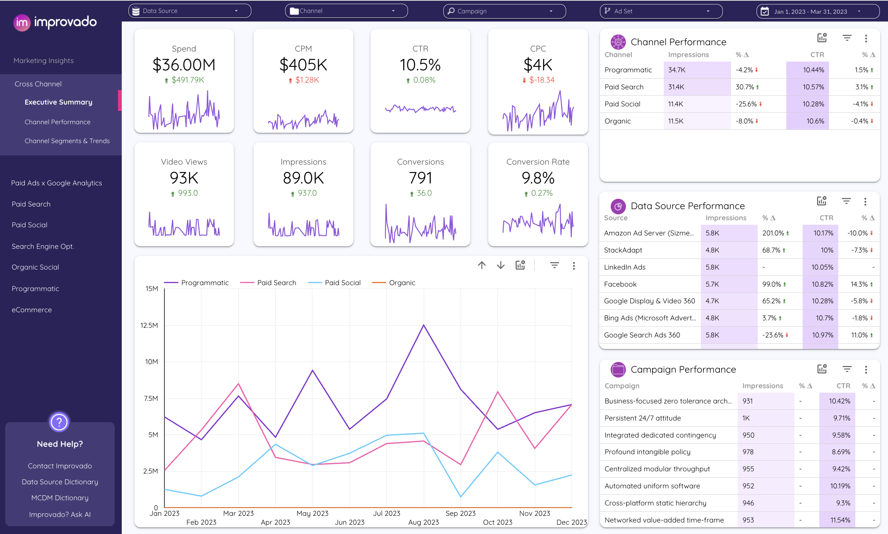

# Technical Customer Success - Dashboard Recreation Challenge

## Overview
Welcome to the TCS assignment! This challenge tests your ability to recreate professional marketing dashboards and communicate insights effectively.

Your mission: Recreate the dashboard from the provided screenshot using your preferred data visualization tool.

## Your Challenge: Recreate a Dashboard 📊

Pick your favorite data visualization tool (Looker, Power BI, Tableau, or whatever you're comfortable with!) and recreate the page from the screenshot.

## What you'll need to do:

1. **Generate dummy data** that brings the dashboard to life
   - Create realistic marketing metrics (impressions, CTR, CPC, conversions, etc.)
   - Include multiple channels (Programmatic, Paid Search, Paid Social, Organic)
   - Multiple data sources (Amazon Ad Server, StackAdapt, LinkedIn Ads, Facebook, Google, Bing, etc.)
   - Include campaign-level data with varying performance metrics

2. **Build out the visualizations** to match the design
   - Top-level KPI cards with sparklines
   - Channel Performance table with metrics and trends
   - Data Source Performance table
   - Campaign Performance table
   - Time series chart showing channel trends over time

3. **Record a quick 1-2 minute video** walking us through your creation

## In your video, share:

- What each widget shows and why it matters
- How someone would actually use this dashboard day-to-day
- Any insights you notice in the data
- Your thought process behind the dummy data generation

## Tools & Approach

Use any data visualization tool you're comfortable with:
- **Looker** - Great for SQL-based dashboards
- **Power BI** - Microsoft's powerful BI platform
- **Tableau** - Industry-standard visualization tool
- **Google Data Studio / Looker Studio** - Free and accessible
- Or any other professional BI tool you prefer!

Think of this as your chance to show us how you approach data visualization and communicate insights. Have fun with it! 🎯

## Deliverables

1. **Live dashboard link** or exported dashboard file
2. **1-2 minute video walkthrough** (unlisted YouTube link, Loom, or any video hosting platform)
3. **Brief description** of your data generation approach (optional but appreciated)

## Submission

Submit your work through this form:
**[Submit Your TCS Assignment](https://docs.google.com/forms/d/e/1FAIpQLSfVSL5v583AX261ILg9eQIzCSbKnBioK8YP-NoV7jAnIycRig/viewform)**

## Evaluation Criteria

We'll assess:
- **Visual accuracy** - How closely does it match the original design?
- **Data realism** - Does your dummy data look realistic and tell a story?
- **Communication** - How well do you explain the dashboard's purpose and usage?
- **Insight generation** - Can you identify and articulate patterns in the data?

---

Questions? Contact: ilia.kolesnikov@improvado.io

Good luck! 🚀
